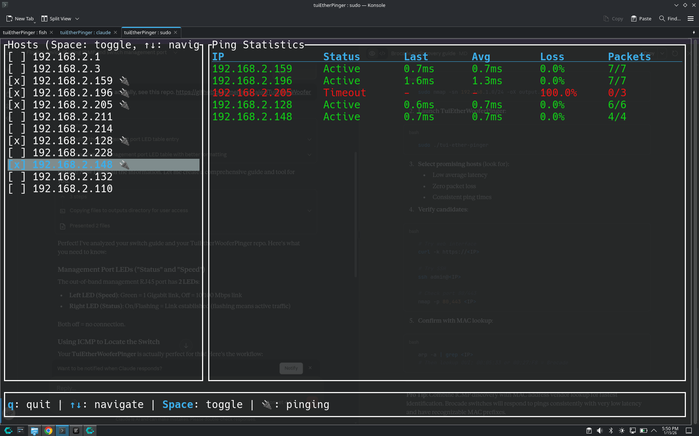

# TUI Ether Pinger 🔌

A terminal-based network monitoring tool with dual modes: ICMP ping monitoring and HTTP health checking. Parse nmap XML output and monitor hosts with real-time statistics in a beautiful interactive interface.



## Features

### Core Features
- Parse nmap XML output files to extract host IP addresses
- Interactive TUI with arrow key navigation
- Multi-host selection with Space bar toggle
- Pause/resume monitoring with 'p' key
- Cute RJ45 connector emoji (🔌) for selected/monitoring hosts
- Concurrent monitoring of multiple hosts
- Clean graceful shutdown

### ICMP Ping Mode (Default)
- Real-time ping statistics: latency (last, avg, min, max), packet loss
- Color-coded status indicators:
  - Green: Active and responding
  - Red: Recent timeout
  - Yellow: Unreachable (5+ consecutive timeouts)
- Ping interval: 1 second, Timeout: 2 seconds

### HTTP Mode (`--http`)
- HTTP health checking on any port (default: 80)
- Statistics: HTTP status code, response time, content size, error messages
- Color-coded HTTP status:
  - Green: 2xx Success responses
  - Yellow: 4xx Client errors
  - Red: 5xx Server errors or network errors
- Request interval: 1 second, Timeout: 5 seconds
- Custom port support with `--port` flag

## Prerequisites

ICMP requires raw socket access. You'll need to run the application with elevated privileges:

### Linux/macOS

Option 1: Run with sudo (simplest)
```bash
sudo ./target/release/tui-ether-pinger
```

Option 2: Set capabilities (Linux only, recommended)
```bash
sudo setcap cap_net_raw+ep ./target/release/tui-ether-pinger
./target/release/tui-ether-pinger
```

## Installation

1. Clone this repository
2. Ensure you have Rust installed (https://rustup.rs/)
3. Build the project:
```bash
cargo build --release
```

## Usage

### Quick Start

1. Generate an nmap XML output file:
```bash
nmap 192.168.2.1/24 -p80 -oX output.xml
```

2. Run the application:
```bash
# ICMP ping mode (default)
sudo ./target/release/tui-ether-pinger

# HTTP mode on port 80
sudo ./target/release/tui-ether-pinger --http

# HTTP mode on custom port
sudo ./target/release/tui-ether-pinger --http --port 8080

# With custom XML file
sudo ./target/release/tui-ether-pinger --http --port 443 nmapoutput.xml
```

### Using Justfile

```bash
# ICMP mode
just run                          # Debug build
just run-release                  # Release build
just run-xml custom.xml           # With custom XML

# HTTP mode
just run-web-80                   # HTTP on port 80 (debug)
just run-web-80-release           # HTTP on port 80 (release)
just run-web-port 8080            # HTTP on custom port
just run-web-80-xml custom.xml    # HTTP with custom XML

# Development
just build                        # Build debug
just release                      # Build release
just install                      # Build and set capabilities
just ci                           # Run all CI checks
```

### Controls

- `↑` / `↓` or `k` / `j` - Navigate up/down through host list
- `Space` - Toggle selection (start/stop monitoring)
- `p` - Pause/resume all monitoring
- `q` or `Esc` - Quit application

### Interface Layout

**ICMP Ping Mode:**
```
┌─ Hosts ──────────────┬─ Ping Statistics ──────────────────────────────────┐
│                      │                                                    │
│ [ ] 192.168.2.1      │ IP              Status   Last    Avg     Loss Pkts │
│ [x] 192.168.2.3  🔌  │ 192.168.2.3     Active   2.3ms  2.1ms   0%   45/45│
│ [ ] 192.168.2.159    │ 192.168.2.211   Timeout  -      3.2ms   12%  88/100│
│ [x] 192.168.2.211 🔌 │                                                    │
│ [ ] 192.168.2.196    │                                                    │
│                      │                                                    │
└──────────────────────┴────────────────────────────────────────────────────┘
 q: quit | ↑↓: navigate | Space: toggle | p: pause | 🔌: checking | Mode: ICMP
```

**HTTP Mode:**
```
┌─ Hosts ──────────────┬─ HTTP Statistics ──────────────────────────────────────────┐
│                      │                                                            │
│ [ ] 192.168.2.1      │ IP          Status      Last    Avg     Size   Error      │
│ [x] 192.168.2.3  🔌  │ 192.168.2.3 200 OK      45ms    52ms    2.3KB  -          │
│ [ ] 192.168.2.159    │ 192.168.2.211 404 Not... 120ms  115ms   512B   -          │
│ [x] 192.168.2.211 🔌 │                                                            │
│ [ ] 192.168.2.196    │                                                            │
│                      │                                                            │
└──────────────────────┴────────────────────────────────────────────────────────────┘
 q: quit | ↑↓: navigate | Space: toggle | p: pause | 🔌: checking | Mode: HTTP:80
```

## Technical Details

### Architecture

- Async runtime: Tokio
- TUI framework: Ratatui
- ICMP library: surge-ping
- HTTP client: reqwest with rustls
- XML parsing: quick-xml

### Design

- Dual mode operation: ICMP ping or HTTP checking
- Each selected host gets its own async task (ping or HTTP)
- ICMP: 1 second interval, 2 second timeout
- HTTP: 1 second interval, 5 second timeout
- Statistics use a 100-sample ring buffer for moving averages
- Thread-safe shared state using Arc<RwLock<HashMap<IP, Stats>>>
- Mode-aware UI rendering and task management

### Project Structure

```
src/
├── main.rs          - Entry point, CLI parsing, terminal setup
├── app.rs           - Application state, mode handling, task management
├── ui.rs            - TUI rendering (mode-aware stats panels)
├── pinger.rs        - ICMP ping async tasks
├── http_checker.rs  - HTTP checking async tasks
├── parser.rs        - nmap XML parsing
├── stats.rs         - AppMode enum and Stats wrapper
├── http_stats.rs    - HTTP-specific statistics
└── (PingStats in stats.rs)
```

## Dependencies

- ratatui 0.28 - TUI framework
- crossterm 0.28 - Terminal control
- tokio 1.41 - Async runtime
- surge-ping 0.8 - ICMP pinging
- reqwest 0.12 - HTTP client (with rustls-tls)
- quick-xml 0.36 - XML parsing
- parking_lot 0.12 - Fast synchronization primitives
- anyhow 1.0 - Error handling
- chrono 0.4 - Time handling
- rand 0.8 - Random number generation

## Advanced Usage

### Custom Port Scanning

```bash
# Scan common web ports
nmap 192.168.1.0/24 -p 80,443,8080,8443 -oX webservers.xml

# Monitor HTTPS (port 443)
sudo ./target/release/tui-ether-pinger --http --port 443 webservers.xml

# Monitor custom application port
sudo ./target/release/tui-ether-pinger --http --port 3000
```

### Development Workflow

```bash
# Watch and rebuild on changes
just watch

# Run all checks before committing
just ci

# Format and check code
just dev
```

### Pause/Resume Feature

Press `p` at any time to pause all monitoring. This is useful when:
- You want to freeze the current statistics
- Reduce network traffic temporarily
- Compare results before/after network changes

When paused, all active tasks are stopped. Pressing `p` again resumes monitoring for all previously selected hosts.

## License

MIT

## Contributing

Pull requests welcome!
